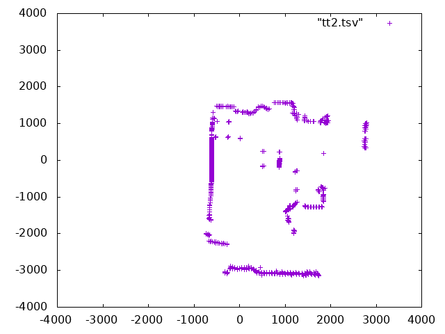

# How to interface the Neato XV11 LIDAR to the Raspberry PI

The actual name of the sensor is Piccolo Laser Distance Sensor, abbreviated into LDS, but many different names are used to refer to it: Neato LDS, Neato lidar, XV-11 lidar, XV-11 sensor...

This repository contains a C++ class which reads the coordinates
and also does the motor control via hardware PWM of the RPI.

Note that this is work in progress and is only sparsely documented at the moment.

# Pinouts

## Data

* Red +5V
* Brown LDS_RX
* OrangeLDS_TX
* Black GND

LDS_TX and LDS_RX are at **3.3V**.

## Motor
The motor is driven by via the hard PWM pin of the RPI. See
[neato_rpi_hardware.pdf] for the circuit which can be
simply soldered on a matrix board and wired to the motor:

* Red PWR
* BlackGND

# Gotchas
* The angle of the data is not aligned with the natural axis of the device. It seems that the first sample of the first packet is in fact looking at
a -10° angle, not 0°. Needs confirmation.
* v2.4 and above: The sensor needs to be turning between 180 and 349 rpm to transmit valid data. Above 349 rpm, the serial interface
becomes the bottleneck and packets will be missing, and blow the lower limit the firmware simply does not send anything. It also seems
that above 320 rpm, data becomes sparse (only one out of two has an actual value).

# Example program
`printdata` prints data out in tab separated data as `x <tab> y <tab> r <tab> phi`. 
Pipe it into a textfile and plot if with `gnuplot`:
```
sudo ./printdata > tt.tsv
gnuplot> plot "tt.tsv"
```



# Data formats for firmware V2.4 and v2.6
A full revolution will yield 90 packets, containing 4 consecutive readings each.
The length of a packet is 22 bytes.
This amounts to a total of 360 readings (1 per degree) on 1980 bytes.
Each packet is organized as follows:

```
<start> <index> <speed_L> <speed_H> [Data 0] [Data 1] [Data 2] [Data 3] <checksum_L> <checksum_H>
```

where:
* start is always 0xFA
* index is the index byte in the 90 packets, going from 0xA0 (packet 0, readings 0 to 3) to 0xF9 (packet 89, readings 356 to 359).
* speed is a two-byte information, little-endian. It represents the speed, in 64th of RPM (aka value in RPM represented in fixed point, with
6 bits used for the decimal part).
* [Data 0] to [Data 3] are the 4 readings. Each one is 4 bytes long, and organized as follows :
  * `byte 0 : <distance 7:0>`
  * `byte 1 : <"invalid data" flag> <"strength warning" flag> <distance 13:8>`
  * `byte 2 : <signal strength 7:0>`
  * `byte 3 : <signal strength 15:8>`
The distance information is in mm, and coded on 14 bits.The minimum distance is around 15cm, and the maximum distance is around 6m.
When bit 7 of byte 1 is set, it indicates that the distance could not be calculated. When this bit is set, it seems that byte 0 contains an error
code. Examples of error code are 0x02, 0x03, 0x21, 0x25, 0x35 or 0x50...
When it's `21`, then the whole block is `21 80 XX XX`, but for all the other values it's the data block is `YY 80 00 00`...
The bit 6 of byte 1 is a warning when the reported strength is greatly inferior to what is expected at this distance. This may happen when the
material has a low reflectance (black material...), or when the dot does not have the expected size or shape (porous material, transparent
fabric, grid, edge of an object...), or maybe when there are parasitic reflections (glass... ).
Bytes 2 and 3 are the LSB and MSB of the strength indication. This value can get very high when facing a retroreflector.
* checksum is a two-byte checksum of the packet.
The algorithm is as follows, provided that `data` is the list of the 20 first bytes, in the same order they arrived in.

```python
def checksum(data):
    """Compute and return the checksum as an int."""
    # group the data by word, little-endian
    data_list = []
    for t in range(10):
        data_list.append( data[2*t] + (data[2*t+1]<<8) )
    # compute the checksum on 32 bits
    chk32 = 0
    for d in data_list:
        chk32 = (chk32 << 1) + d
    # return a value wrapped around on 15bits, and truncated to still fit into 15 bits
    checksum = (chk32 & 0x7FFF) + ( chk32 >> 15 ) # wrap around to fit into 15 bits
    checksum = checksum & 0x7FFF # truncate to 15 bits
    return int( checksum )
```


# Credit

This is forked from Dmitry V. Sokolov's git repo: https://github.com/ssloy/neato-xv11-lidar
